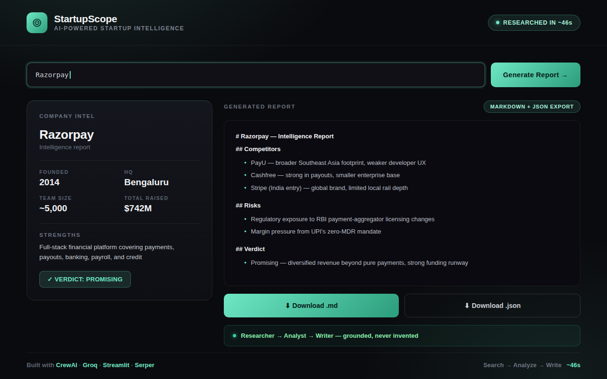
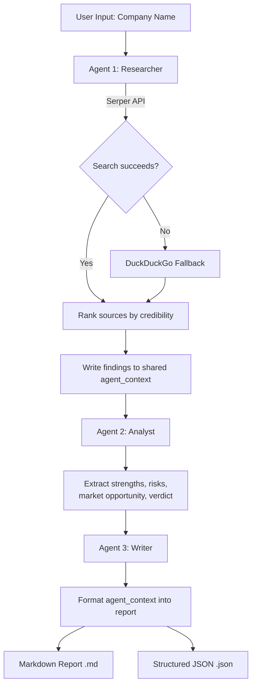

<div align="center">

# 🔍 StartupScope

### AI-Powered Startup Intelligence Tool

A multi-agent research tool that automatically researches any startup or company and generates a structured intelligence report — covering funding, business model, competitors, strengths, risks, and recent news.

[](https://startupscope-ai.streamlit.app/)
[](https://github.com/ayush-s-tomar/startupscope/actions)
[](./LICENSE)
[](https://www.python.org/)
[](https://www.crewai.com/)
[](https://groq.com/)


**👉 [Try it live](https://startupscope-ai.streamlit.app/)**

</div>

---

## 📑 Table of Contents

- [Screenshot — Compare Mode](#-screenshot--compare-mode)
- [Full Walkthrough](#-full-walkthrough)
- [What It Does](#what-it-does)
- [Features](#features)
- [Sample Output](#-sample-output)
- [How the Agents Work](#how-the-agents-work)
- [Tech Stack](#tech-stack)
- [Project Structure](#project-structure)
- [Setup & Installation](#setup--installation)
- [How to Use](#how-to-use)
- [CI/CD & Deployment](#cicd)
- [Known Limitations](#known-limitations)
- [What I Learned](#what-i-learned)
- [License](#license)

---

## 📸 Screenshot — Compare Mode



*Real output from Compare Mode — two intelligence reports generated and rendered side-by-side in a single run.*

---

## 🎬 Full Walkthrough

https://github.com/user-attachments/assets/bb52f74e-5154-4d1f-8fa2-8cdf1db6ce4f

*Click to play — full walkthrough of single-company research and side-by-side comparison.*

---

## What it does

- Type any company name (e.g. Razorpay, Zepto, Notion)
- 3 AI agents research, analyze, and write a full report
- Get funding history, business model, competitors, strengths, risks
- Watch live progress as each agent works — no more silent waiting
- Compare two companies side-by-side
- Browse past reports from a persistent history sidebar
- Download the report as Markdown **or** structured JSON

---

## Features

- **Multi-Agent System** — 3 specialized agents work sequentially (Researcher → Analyst → Writer), sharing a structured context object so data flows cleanly between steps
- **Live Web Search with Fallback** — Agents search the internet via Serper API, with automatic DuckDuckGo fallback if Serper fails or hits quota
- **Source Credibility Scoring** — Search results are ranked by domain trust (Crunchbase, TechCrunch, Reuters rank above forums/Q&A sites) before agents read them
- **Live Progress Streaming** — Real-time step-by-step status ("🔍 Researcher is searching...", "📊 Analyst is extracting insights...") replaces the old silent spinner
- **Report History** — Past reports are saved and browsable from a sidebar, with timestamps and single/compare mode tags
- **Compare Mode** — Research two companies side-by-side with tabbed and split-view comparison
- **Structured JSON Output** — Every report is also parsed into a typed JSON schema (funding, competitors, strengths, risks, verdict) for programmatic use
- **Multi-Format Export** — Each run saves both `.md` and `.json` files to `outputs/`
- **CLI Batch Mode** — Research multiple companies in one run via a CSV file, with built-in delay to respect API rate limits
- **Resilient Retries** — Exponential backoff automatically retries transient Groq/API failures instead of crashing
- **Clean Dual-Theme UI** — Professional dark-themed interface with toggleable "Brief" and "Console" visual modes

---

## 📄 Sample Output

<details>
<summary>Click to expand — excerpt from a real generated report (Razorpay)</summary>

```markdown
# Razorpay — Intelligence Report

## Funding
Total raised: $741M | Latest round: Series F ($375M, 2021)
Valuation: $7.5B | Key investors: GIC, Sequoia, Tiger Global

## Business Model
B2B payment gateway + neobanking suite for Indian SMEs and
enterprises, monetizing via transaction fees and SaaS add-ons
(RazorpayX, Capital).

## Strengths
- Deep integration with Indian banking rails (UPI, NEFT, RTGS)
- Diversified beyond payments into lending and banking

## Risks
- Margin pressure from UPI's zero-MDR regulation
- Intensifying competition from Cashfree, PayU, Stripe India
```

*Full reports also include competitors, recent news, and a structured verdict — see the [live demo](https://startupscope-ai.streamlit.app/) for a complete example.*

</details>

---

## How the Agents Work



If any step fails on a transient API error, the crew retries automatically with exponential backoff before giving up.

---

## Tech Stack

| Layer | Tech |
|-------|------|
| Agent Framework | CrewAI |
| LLM | Groq API (LLaMA 3.3 70B) |
| Web Search | Serper Dev API + DuckDuckGo (fallback) |
| Frontend | Streamlit |
| Deployment | Render / Streamlit Community Cloud |
| CI | GitHub Actions |

---

## Project Structure

```
startupscope/
├── app.py                    # Streamlit UI — live progress, history sidebar, compare mode
├── main.py                   # Terminal runner — single company or CSV batch mode
├── history.py                 # Report history persistence (load/add/clear)
├── theme.py                   # Dual-theme (Brief/Console) injection
├── requirements.txt           # Python dependencies
├── render.yaml                 # Render deployment config — health checks, env vars
├── .env                        # API keys (not committed)
├── .gitignore
├── crew/
│   ├── agents.py              # 3 agent definitions + shared agent_context schema
│   ├── tasks.py                # 3 task definitions, wired to agent_context
│   └── crew.py                  # Crew assembly, retry logic, JSON schema export
├── tools/
│   └── search_tool.py          # Serper + DuckDuckGo fallback, credibility scoring
├── assets/                     # README media (gif, screenshot)
├── .github/
│   └── workflows/
│       └── ci.yml               # Lint + smoke-test on every push/PR
└── outputs/                     # Generated .md and .json reports saved here
```

---

## Setup & Installation

### 1. Clone the repository
```bash
git clone https://github.com/ayush-s-tomar/startupscope.git
cd startupscope
```

### 2. Install dependencies
```bash
pip install -r requirements.txt
```

### 3. Set up your API keys

Get your free Groq key at [console.groq.com](https://console.groq.com)
Get your free Serper key at [serper.dev](https://serper.dev)

Create a `.env` file in the root directory:
```
GROQ_API_KEY=your_groq_key_here
SERPER_API_KEY=your_serper_key_here
```

### 4. Run the app
```bash
streamlit run app.py
```
Open your browser and go to: **http://localhost:8501**

---

## How to Use

### Web App
1. Open the app in your browser
2. Type any company name in the input field
3. Click **Generate Intelligence Report** and watch the live agent progress
4. Read the report and download it as `.md` or `.json`
5. Switch to **Compare Two Companies** mode to research two startups side-by-side
6. Browse past reports anytime from the sidebar history

### Command Line
```bash
# Interactive prompt (original behaviour)
python main.py

# Single company via flag
python main.py --company Razorpay

# Batch mode — researches every company in a CSV, one at a time
python main.py --batch companies.csv
```

`companies.csv` format:
```
company
Razorpay
Zepto
Notion
Groww
```

---

## CI/CD

Every push and pull request to `main` runs a GitHub Actions workflow (`.github/workflows/ci.yml`) that:

- Installs dependencies on Python 3.10, 3.11, and 3.12
- Lints the codebase with `ruff`
- Byte-compiles every module as a smoke test (`python -m py_compile`)
- Fails the build on any lint or import error before it reaches `main`

See the live status badge at the top of this README, or check the [Actions tab](https://github.com/ayush-s-tomar/startupscope/actions).

### Deployment (Free on Render)

1. Push this repo to GitHub
2. Go to [render.com](https://render.com) → New → Web Service
3. Connect your GitHub repo
4. Set **Build Command**: `pip install -r requirements.txt`
5. Set **Start Command**: `streamlit run app.py --server.port $PORT --server.address 0.0.0.0`
6. Add environment variables: `GROQ_API_KEY` and `SERPER_API_KEY`
7. (Optional) tune `MAX_RETRIES` and `BATCH_DELAY` from the Render dashboard without touching code
8. Deploy! Render's health check automatically restarts the service if it crashes

---

## Known Limitations

- Some fields (founding year, HQ, exact funding totals) come back as "Not specified" for companies that don't publicly disclose this data or where search results are sparse — the agents are instructed to never invent figures, so an honest gap is shown instead of a guess
- Report quality depends on Serper/DuckDuckGo result freshness; very recent funding rounds or news may not surface immediately
- Free-tier Groq and Serper rate limits mean heavy back-to-back usage can trigger the retry/backoff logic, slightly increasing response time

---

## What I Learned

- Building multi-agent AI systems with CrewAI, including shared context passing between agents
- Integrating LLM APIs (Groq — LLaMA 3.3 70B) with retry and backoff handling for production reliability
- Real-time web search integration with fallback strategies (Serper → DuckDuckGo) and source credibility filtering
- Sequential agent orchestration and task chaining with structured, typed outputs (JSON schema generation from LLM output)
- Building responsive, real-time UI feedback in Streamlit using threading and progress state
- Designing for resilience on constrained infrastructure (free-tier rate limits, health checks, exponential backoff)
- Deploying and maintaining a multi-service Python app on Render
- Setting up CI (GitHub Actions) to catch lint/import errors before deploy

---

## License

Distributed under the **MIT License**. See [`LICENSE`](./LICENSE) for the full text — free to use and modify.

---

<div align="center">

Built by **[Ayush Singh Tomar](https://github.com/ayush-s-tomar)**

</div>
