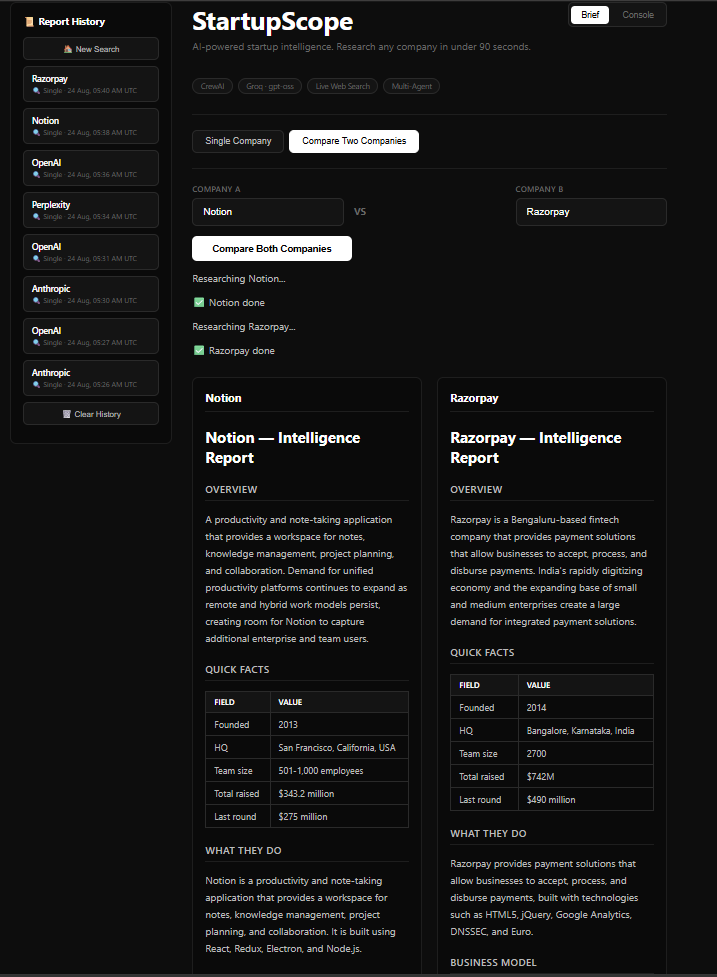
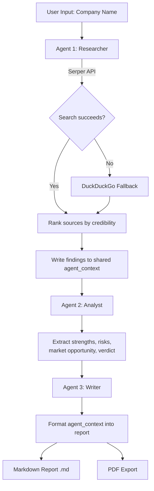

<div align="center">

# 🔍 StartupScope

### AI-Powered Startup Intelligence Tool

> **TL;DR:** Type a company name, get a full VC-style intelligence report in ~90s — 3 AI agents research, analyze, and write it, with live progress, side-by-side comparisons, and PDF export.

A multi-agent research tool that automatically researches any startup or company and generates a structured intelligence report — covering funding, business model, competitors, strengths, risks, and recent news.

[](https://startupscope-q76d.onrender.com/)
[](https://github.com/ayush-s-tomar/startupscope/actions)
[](./LICENSE)
[](https://www.python.org/)
[](https://www.crewai.com/)
[](https://groq.com/)


**👉 [Try it live](https://startupscope-q76d.onrender.com/)**

</div>

---

## 📑 Table of Contents

- [Screenshot — Compare Mode](#️-screenshot--compare-mode)
- [Full Walkthrough](#-full-walkthrough)
- [Known Limitations](#known-limitations)
- [What It Does](#what-it-does)
- [Features](#features)
- [Sample Output](#-sample-output)
- [How the Agents Work](#how-the-agents-work)
- [Tech Stack](#tech-stack)
- [Project Structure](#project-structure)
- [Setup & Installation](#setup--installation)
- [How to Use](#how-to-use)
- [Deploy to Render](#deploy-to-render)
- [CI/CD](#cicd)
- [Data Quality Notes](#data-quality-notes)
- [What I'd Add Next](#what-id-add-next)
- [What I Learned](#what-i-learned)
- [License](#license)

---

## 🖼️ Screenshot — Compare Mode



*Notion vs Razorpay — both reports fully populated across every field, rendered in independent columns.*

---

## 🎬 Full Walkthrough

https://github.com/user-attachments/assets/bb52f74e-5154-4d1f-8fa2-8cdf1db6ce4f

*Click to play — full walkthrough of single-company research and side-by-side comparison.*

---

## Known limitations

- **In-memory job store** — an in-flight report is lost if the Render service restarts mid-run. Fine at this scale (single-process, free-tier deployment), but not durable across restarts — see "What I'd add next."
- **Ephemeral storage on Render's free tier** — report history and `outputs/` reset on redeploy/restart.
- **Free-tier cold starts** — the service spins down on inactivity, so the first request after idle can take 30–50s.

---

## What it does

- Type any company name (e.g. Razorpay, Zepto, Notion)
- 3 AI agents research, analyze, and write a full report
- Get funding history, business model, competitors, strengths, risks
- Watch live progress as each agent works, polled from a background job — no silent waiting
- Compare two companies side-by-side
- Browse past reports from a persistent history sidebar
- Download the report as Markdown **or** PDF

---

## Features

- **Multi-Agent System** — 3 specialized agents work sequentially (Researcher → Analyst → Writer), sharing a structured context object so data flows cleanly between steps
- **Async Job API** — `POST /api/run` kicks off a background thread and returns a job ID immediately; the frontend polls `GET /api/status/{job_id}` for live stage updates, so the UI never blocks on a single long HTTP request
- **Live Web Search with Fallback** — Agents search the internet via Serper API, with automatic DuckDuckGo fallback if Serper fails or hits quota
- **Source Credibility Scoring** — Search results are ranked by domain trust (Crunchbase, TechCrunch, Reuters rank above forums/Q&A sites) before agents read them
- **Live Progress Streaming** — Real-time step-by-step status ("🔍 Researcher is extracting facts...", "📊 Analyst is extracting insights...") with a hard 240s watchdog timeout so no job can hang forever
- **Report History** — Past reports are saved and browsable from a sidebar, with timestamps and single/compare mode tags
- **Compare Mode** — Research two companies side-by-side, rendered together in one combined report
- **Custom Markdown Renderer** — A small hand-written JS renderer (headings, lists, bold, tables, horizontal rules) turns each report into styled HTML client-side, with a dedicated table renderer for the Quick Facts section
- **Dual-Format Export** — Download any report as `.md` or a formatted `.pdf` (generated server-side with fpdf2), straight from the browser
- **CLI Batch Mode** — Research multiple companies in one run via a CSV file, with built-in delay to respect API rate limits
- **Resilient Retries** — Exponential backoff with primary/fallback Groq model switching automatically retries transient API failures instead of crashing
- **Fact-Guarded Output** — Funding figures are cross-checked against raw search text before being shown; unsupported claims are stripped rather than trusted at face value
- **Dual-Theme UI** — Toggleable dark ("Brief") and light ("Console") themes, driven by CSS custom properties

---

## 📄 Sample Output

<details>
<summary>Click to expand — excerpt from a real generated report (Razorpay)</summary>

```markdown
# Razorpay — Intelligence Report

## Funding
Total raised: $741M | Latest round: Series F ($375M, 2021)
Valuation: $7.5B | Key investors: GIC, Sequoia, Tiger Global

## Business Model
B2B payment gateway + neobanking suite for Indian SMEs and
enterprises, monetizing via transaction fees and SaaS add-ons
(RazorpayX, Capital).

## Strengths
- Deep integration with Indian banking rails (UPI, NEFT, RTGS)
- Diversified beyond payments into lending and banking

## Risks
- Margin pressure from UPI's zero-MDR regulation
- Intensifying competition from Cashfree, PayU, Stripe India
```

*Full reports also include competitors, recent news, and a structured verdict — see the [live demo](https://startupscope-q76d.onrender.com/) for a complete example.*

</details>

---

## How the Agents Work



Each stage runs as a single flat LLM call rather than an agent loop, keeping token cost predictable. If a step fails on a transient error, the pipeline retries with exponential backoff — switching from the primary to a fallback Groq model if quota is exhausted — before giving up.

---

## Tech Stack

| Layer | Tech |
|-------|------|
| Agent Framework | CrewAI |
| LLM | Groq API (`openai/gpt-oss-120b` primary, `openai/gpt-oss-20b` fallback) |
| Web Search | Serper Dev API + DuckDuckGo (fallback) |
| Backend | FastAPI (async job API — start/poll/download endpoints) |
| Frontend | Static HTML/CSS/vanilla JS, served by FastAPI's `StaticFiles` |
| Deployment | Render |
| CI | GitHub Actions |

---

## Project Structure

```
startupscope/
├── app.py                    # FastAPI app — job API (/api/run, /api/status, /api/history, /api/download), serves static/
├── main.py                   # Terminal runner — single company or CSV batch mode
├── history.py                 # Report history persistence (load/add/clear)
├── requirements.txt           # Python dependencies
├── render.yaml                 # Render service config (build/start commands, env vars, health check)
├── .env                        # API keys (not committed)
├── .gitignore
├── crew/
│   ├── agents.py               # LLM call wrapper — retry/backoff, primary/fallback model, empty-completion guard
│   ├── tasks.py                # Prompt builders for research/analysis/writer stages
│   └── crew.py                  # Pipeline orchestration, fact-checking guards, progress callback
├── tools/
│   └── search_tool.py          # Serper + DuckDuckGo fallback, credibility scoring
├── static/
│   └── index.html               # Full frontend — UI, custom markdown-to-HTML renderer, theme toggle, polling logic
├── assets/                     # README media (gif, screenshot)
├── .github/
│   └── workflows/
│       └── ci.yml               # Lint + smoke-test on every push/PR
└── outputs/                     # Generated .md and .json reports saved here
```

---

## Setup & Installation

### 1. Clone the repository
```bash
git clone https://github.com/ayush-s-tomar/startupscope.git
cd startupscope
```

### 2. Install dependencies
```bash
pip install -r requirements.txt
```

### 3. Set up your API keys

Get your free Groq key at [console.groq.com](https://console.groq.com)
Get your free Serper key at [serper.dev](https://serper.dev)

Create a `.env` file in the root directory:
```
GROQ_API_KEY=your_groq_key_here
SERPER_API_KEY=your_serper_key_here
```

### 4. Run the app
```bash
uvicorn app:app --reload
```
Open your browser and go to: **http://localhost:8000**

---

## How to Use

### Web App
1. Open the app in your browser
2. Type any company name in the input field, or pick a quick example
3. Click **Generate Intelligence Report** and watch the live progress bar
4. Read the report and download it as `.md` or `.pdf`
5. Switch to **Compare Two Companies** mode to research two startups side-by-side
6. Browse past reports anytime from the sidebar history

### Command Line
```bash
# Interactive prompt (original behaviour)
python main.py

# Single company via flag
python main.py --company Razorpay

# Batch mode — researches every company in a CSV, one at a time
python main.py --batch companies.csv
```

`companies.csv` format:
```
company
Razorpay
Zepto
Notion
Groww
```

---

## Deploy to Render

1. Fork/clone this repo and push to GitHub
2. Go to [render.com](https://render.com) → New → Web Service → connect repo
3. Render picks up `render.yaml` automatically — build command (`pip install -r requirements.txt`), start command (`uvicorn app:app --host 0.0.0.0 --port $PORT`), and health check are already configured
4. In **Environment**, set the two required secrets (never committed to the repo):
   ```
   GROQ_API_KEY = your_groq_api_key_here
   SERPER_API_KEY = your_serper_api_key_here
   ```
5. Deploy

> **Note:** Render's free tier has ephemeral storage and spins down on inactivity — report history and saved `outputs/` files reset on redeploy/restart, and the first request after idle may take 30–50s. Jobs also live only in-process (in-memory), so an in-flight job is lost if the service restarts mid-run — the report itself is only durable once it finishes and is written to history.

---

## CI/CD

Every push and pull request to `main` runs a GitHub Actions workflow (`.github/workflows/ci.yml`) that:

- Installs dependencies on Python 3.10, 3.11, and 3.12
- Lints the codebase with `ruff`
- Byte-compiles every module as a smoke test (`python -m py_compile`)
- Fails the build on any lint or import error before it reaches `main`

See the live status badge at the top of this README, or check the [Actions tab](https://github.com/ayush-s-tomar/startupscope/actions).

---

## Data Quality Notes

- Some fields (founding year, HQ, exact funding totals) come back as "Not specified" for companies that don't publicly disclose this data or where search results are sparse — the agents are instructed to never invent figures, so an honest gap is shown instead of a guess
- Report quality depends on Serper/DuckDuckGo result freshness; very recent funding rounds or news may not surface immediately
- Free-tier Groq and Serper rate limits mean heavy back-to-back usage can trigger the retry/backoff logic, slightly increasing response time

---

## What I'd add next

- Persistent job/history store (Postgres or Redis) instead of in-memory, so a Render restart can't lose an in-flight report
- Server-sent events or WebSocket push instead of client polling for progress updates
- A second, independent LLM-as-judge pass to catch fact-guard misses the regex-based scrubs don't cover
- Automated eval harness (sample company set + expected-field checks) wired into CI

---

## What I Learned

- Building multi-agent AI systems with CrewAI, including shared context passing between agents
- Designing an async job API in FastAPI (start → poll → result) instead of a single blocking request, so a 90–150s pipeline never times out an HTTP call
- Migrating a UI from a Python framework (Streamlit) to a plain HTML/CSS/JS frontend served statically — including hand-writing a small markdown-to-HTML renderer with table support
- Integrating LLM APIs (Groq) with retry, backoff, and primary/fallback model switching for production reliability
- Guarding against silent LLM failure modes — empty completions from reasoning models, unsupported financial claims, malformed JSON — with mechanical, non-LLM verification passes
- Real-time web search integration with fallback strategies (Serper → DuckDuckGo) and source credibility filtering
- Designing for resilience on constrained infrastructure (free-tier rate limits, health checks, exponential backoff, a hard job-timeout watchdog)
- Deploying and maintaining a FastAPI app on Render, with CI (GitHub Actions) catching lint/import errors before deploy

---

## License

Distributed under the **MIT License**. See [`LICENSE`](./LICENSE) for the full text — free to use and modify.

---

<div align="center">

Built by **[Ayush Singh Tomar](https://github.com/ayush-s-tomar)**

</div>